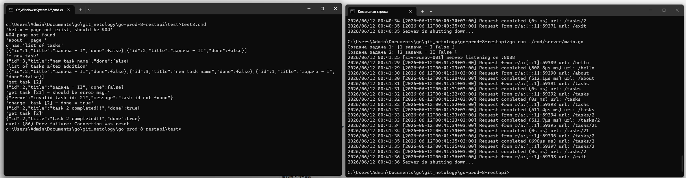
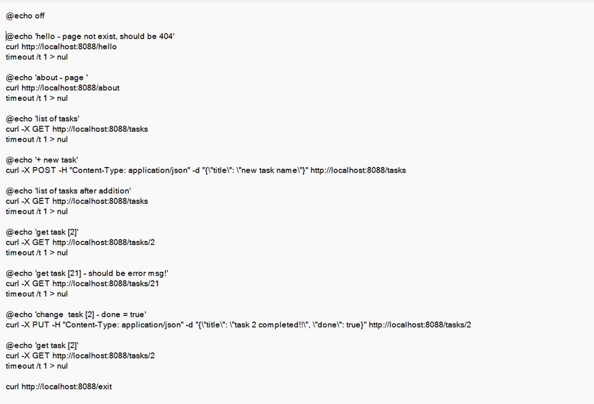

# go-prod-8-restapi
Создание REST API-сервиса

# Installation

```  
cd ..\go-prod-8-restapi

 on main folder
 go work init
 go mod init go-prod-8-restapi

 go mod tidy

```
 go run ./cmd/server/main.go
 go build ./...

```

```
```txt
   go-prod-8-restapi/  
   ├── cmd/  
   │   └── server/  
   │       └── main.go  
   │  
   ├── internal/  
   │   ├── handlers/  tasks.go  
   │   ├── models/    task.go  
   │   └── storage/   storage.go  
   │  
   └── go.mod  
    
       README.md   
       go.mod  
       test.cmd  


```
http://localhost:8088
curl http://localhost:8088

### Завершить работу сервера:  
 http://localhost:8088/exit  
 или отправить сигнал прерывания (SIGINT): в терминале нажать Ctrl + C.   
 или taskkill /PID <PID> /F

### testing (test2.cmd):  
```txt* >... go-prod-8-restapi\test>test3.cmd  
    ```txt
    'hello - page not exist, should be 404'  
    404 page not found  
    
    'about - page '  
    o nas!'list of tasks'  
    [{"id":1,"title":"задача - I","done":false},  
     {"id":2,"title":"задача - II","done":false}]  
      
    '+ new task'  
    {"id":3,"title":"new task name","done":false}  
      
    'list of tasks after addition'  
    [{"id":2,"title":"задача - II","done":false},  
     {"id":3,"title":"new task name","done":false},  
     {"id":1,"title":"задача - I","done":false}]  
      
    'get task [2]'  
    {"id":2,"title":"задача - II","done":false}  
      
    'get task [21] - should be error msg!'  
    {"error":"invalid task id: 21","message":"task id not found"}  
    'change  task [2] - done = true'  
    {"id":2,"title":"task 2 completed!!","done":true}  
      
    'get task [2]'  
    {"id":2,"title":"task 2 completed!!","done":true}  

    
### log output:    
* > .. go-prod-8-restapi>go run ./cmd/server/main.go  
    Создана задача 1: {1 задача - I false }  
    Создана задача 2: {2 задача - II false }  
    2026/06/12 00:41:25 [srv-runov-001] Server listening on :8088  
    2026/06/12 00:41:29 [2026-06-12T00:41:29+03:00] Request from r/a:[::1]:59389 url: /hello  
    2026/06/12 00:41:29 [2026-06-12T00:41:29+03:00] Request completed (508.8µs ms) url: /hello  
    2026/06/12 00:41:30 [2026-06-12T00:41:30+03:00] Request from r/a:[::1]:59390 url: /about  
    2026/06/12 00:41:30 [2026-06-12T00:41:30+03:00] Request completed (512.1µs ms) url: /about  
    2026/06/12 00:41:31 [2026-06-12T00:41:31+03:00] Request from r/a:[::1]:59391 url: /tasks  
    2026/06/12 00:41:31 [2026-06-12T00:41:31+03:00] Request completed (0s ms) url: /tasks  
    2026/06/12 00:41:32 [2026-06-12T00:41:32+03:00] Request from r/a:[::1]:59392 url: /tasks  
    2026/06/12 00:41:32 [2026-06-12T00:41:32+03:00] Request completed (0s ms) url: /tasks  
    2026/06/12 00:41:32 [2026-06-12T00:41:32+03:00] Request from r/a:[::1]:59393 url: /tasks  
    2026/06/12 00:41:32 [2026-06-12T00:41:32+03:00] Request completed (511.4µs ms) url: /tasks  
    2026/06/12 00:41:33 [2026-06-12T00:41:33+03:00] Request from r/a:[::1]:59394 url: /tasks/2  
    2026/06/12 00:41:33 [2026-06-12T00:41:33+03:00] Request completed (511.7µs ms) url: /tasks/2  
    2026/06/12 00:41:34 [2026-06-12T00:41:34+03:00] Request from r/a:[::1]:59395 url: /tasks/21  
    2026/06/12 00:41:34 [2026-06-12T00:41:34+03:00] Request completed (0s ms) url: /tasks/21  
    2026/06/12 00:41:35 [2026-06-12T00:41:35+03:00] Request from r/a:[::1]:59396 url: /tasks/2  
    2026/06/12 00:41:35 [2026-06-12T00:41:35+03:00] Request completed (690µs ms) url: /tasks/2  
    2026/06/12 00:41:35 [2026-06-12T00:41:35+03:00] Request from r/a:[::1]:59397 url: /tasks/2  
    2026/06/12 00:41:35 [2026-06-12T00:41:35+03:00] Request completed (0s ms) url: /tasks/2  
    2026/06/12 00:41:36 [2026-06-12T00:41:36+03:00] Request from r/a:[::1]:59398 url: /exit  
    2026/06/12 00:41:36 Server is shutting down...  
      
`
`

### references:
https://github.com/golang/go/wiki/Modules

```